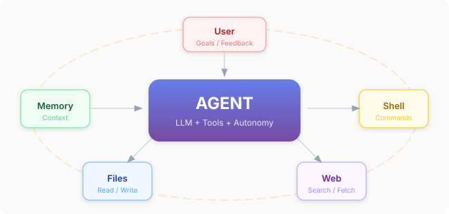
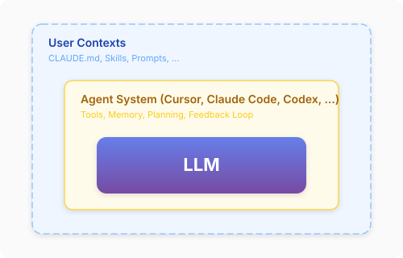

# AI Agents and Your Research

*Lei Wang and AI agents*

*January 2026*

---

AI agents are transforming scientific research in unprecedented ways. Among many things, vibe coding is particularly relevant to computational physics research. The way we work—and what we should focus on—is changing rapidly. In this note, I'll share some practical experiences and thoughts with you: graduate students at IOP. 

## From Chatbot to Agent

A Large Language Model (LLM) is an autoregressive generative model for text tokens. Given a sequence of tokens, it predicts the probability distribution of the next token, samples from that distribution, appends the new token, and repeats. This simple loop generates coherent text one token at a time.

Mathematically, this amounts to sampling the response $y$ from the conditional distribution $p_{\theta}(y|x)$. Here, $\theta$ denotes the model parameters—there can be hundreds of billions of them, encoding a [blurry compression](https://www.newyorker.com/tech/annals-of-technology/chatgpt-is-a-blurry-jpeg-of-the-web) of the training data. What you can control is the **context** $x$: those tokens the model can "see" when making the prediction. This context has a finite size (the "context window"—ranging from thousands to millions of tokens in modern models). Everything the model knows about your task must fit in this window: your question, relevant background, previous conversation turns, and any documents you've provided. Crucially, **the LLM has no persistent state**—each conversation starts fresh, and it cannot verify whether its outputs are correct. It simply predicts what tokens are likely to come next, based on patterns learned during training.

An **AI agent** extends the raw LLM to address these limitations:

```
Agent = LLM + Tools + Memory + Feedback
```

- **Tools**: Interact with the environment—read/write files, execute code, search the web, run tests
- **Memory**: Manage context within sessions and persist knowledge across sessions
- **Feedback**: Observe outcomes, verify against reality, decide next steps, iterate toward a goal

The key is the **reflection cycle**: **Observe → Reason → Act → Verify → Repeat**.



Unlike a chatbot that responds once and waits, an agent operates in a loop. After taking an action, it observes the result (Did the code run? Did the test pass? What error appeared?), reasons about what to do next, and continues. This is where **verification** enters: the agent can check its own work by running tests, examining outputs, or comparing against expected results. **Context management** also becomes crucial—the agent must decide what information to keep in its limited context window: the current goal, execution plan, relevant code, error messages, and lessons learned. This observe-act-verify loop, combined with careful context management, is what transforms a one-shot predictor into something that can actually *get things done*.

## What Can Agents Do for Your Research?

Current AI agents (Cursor, Claude Code, Codex, etc) are remarkably useful for computational research. Here's what they can help with:

- **Onboarding**: Read papers, code, and documentation to quickly understand a topic
- **Brainstorming**: Explore different approaches and catch edge cases you might miss
- **Prototyping**: Setup programming environment, write code fast, iterate until it works
- **Monitoring**: Babysit jobs, parse logs, restart on failure
- **Analysis**: Compute statistics, analyse results via different angles
- **Reporting**: Summarize research logs 

Let's see this in action with three examples, one from each stage of research: reading, computing, and writing.

**Reading papers.** You can simply ask an LLM to pick out papers for you from the daily arXiv listing. But the recommendations get much better once you teach it your taste—either softly, by describing your interests in natural language, or programmatically, by letting the agent build a tool for you. For example, the [paper_recommender](https://github.com/wangleiphy/paper_recommender/) built with an AI agent does the latter: it embeds the papers I have tagged as favorites together with my own arXiv papers, and recommends new papers by semantic similarity. AI agents allow customization: you can easily build the recommender to express your wish.

**Running simulations.** As an exercise, we ask an agent to run Sandvik's stochastic series expansion (SSE) code [ssebasic.f90](https://physics.bu.edu/~sandvik/vietri/sse/ssebasic.f90) for the 2D Heisenberg antiferromagnet. A subtle compiler-related bug sneaks into the random number generator: the code compiles cleanly, yet silently produces wrong results. What saves the day is that the code comes with detailed [documentation](https://physics.bu.edu/~sandvik/programs/ssebasic/ssebasic.html) and published [benchmark results](https://physics.bu.edu/~sandvik/vietri/sse/results.html)—the former gives the agent the context to understand the program, and the latter lets it verify the outputs and catch the bug. Contexts and benchmarks are as valuable as the code itself.

**Writing papers.** Given enough context—research notes, code, and results—current models can produce a decent paper draft in one shot. Nevertheless, skills distilled from experienced researchers, such as this [paper-review-checklist](https://github.com/QuantumBFS/claude-code-skills/tree/main/plugins/paper-review-checklist), still sharpen the draft. Moreover, a fresh-eyes reviewer—a subagent that reads the draft without any of the conversation context—catches the common error of notation used before it is defined, and helps to tune the presentation.

## Working Effectively with AI Agents

To get the most out of AI agents, some engineering practices are useful. Then, you can build up good interaction habits. Let me share what I've learned.

### Engineering Practices

Agile development encompasses several core engineering practices—documentation, automated testing, and version control—woven into iterative development cycles.[^1] In the era of AI agents, these practices become even more essential, but for interesting new reasons.

**Test-Driven Development (TDD)—verifications for AI.** Traditionally, TDD ensures code correctness by writing tests before implementation—catching bugs early and enabling confident refactoring. With AI agents, this practice becomes even more critical. AI-generated code is not automatically correct; the only way to trust it is to **test it**. Tests are where the feedback term becomes concrete: they are the signal the agent loops on, and writing them well is how you decide what "correct" means. You can build confidence and trust in AI incrementally: unit tests for functions, integration tests for modules, end-to-end tests for the full pipeline, and validation against known benchmarks.

**Documentation — context for Humans AND AI.** In Agile, documentation keeps team members aligned on project structure, workflows, and conventions. With AI agents, documentation takes on a new role: it becomes the AI's long-term memory. Documents such as `CLAUDE.md` tell the AI agent about project goals, key files, and gotchas. AI reads those files to provide contexts in future sessions. 

**Version Control — Your Safety Net.** Git has always been essential for tracking changes and enabling collaboration. With AI agents, it becomes your safety net. The agent will make mistakes—it will sometimes break things. Frequent commits let you easily roll back when something goes wrong. Branches let you explore experimental approaches without risk. Via version control, both you and AI always have a clear history of what has changed and why.

Overall, I find the advice in the timeless [The Pragmatic Programmer](https://www.amazon.com/Pragmatic-Programmer-journey-mastery-Anniversary/dp/0135957052) is still (perhaps even more) relevant with AI agents. Check Jinguo Liu's [blog posts](https://www.jinguo-group.science/Blogs/) for more practical instructions on these topics. 

### Interaction Habits

Despite what folklore suggests, LLMs and the agents built around them are not truly "black boxes"—both can be understood. [This tutorial](https://wangleiphy.github.io/talks.html#aaa-hangzhou2025) explains how autoregressive generative models work, while [learn-claude-code](https://github.com/shareAI-lab/learn-claude-code) shows how to build an agent from scratch in ~50 lines of code. Understanding these mechanisms reveals good habits for using AI agents effectively. 

**From "?" to "!".**  You can always start by asking questions—either to gain understanding yourself or to provide AI agents the necessary context. This step also aligns and calibrates the AI system: if things go wrong, it may already show up in this step. Some AI agents have an explicit "Ask" mode—use it. Once you are confident about yourself and the agent, you can send imperative commands to let AI complete tasks. 

**Build step by step.** Start small, verify, then expand—each step testable before moving to the next. This mirrors [Chain-of-Thought (CoT)](https://arxiv.org/abs/2201.11903) prompting, where "think step by step" improves LLM reasoning. Agent-level planning is the same principle at larger scale. 

**Learn from mistakes.** AI will make errors—this is expected. But don't just retry blindly. Diagnose first: ask "Why did this fail?", check assumptions about paths, formats, and types, then record lessons in the documentation. In this way, AI can improve over time with persistent memory across sessions. 

### Cultivating Your Personal AI

As you collaborate more and more with AI, you'll accumulate tools, skills, and lessons. The system you interact with becomes more and more personalized.  



The figure shows a three-layer architecture. At the core sits the **LLM**—the same foundation model everyone uses. Wrapped around it is the **Agent System** (Cursor, Claude Code, Codex, etc.), which provides tools, memory, planning, and the feedback loop. The outermost layer is **your context**—the CLAUDE.md files, documentation, custom skills, and accumulated lessons that make the system uniquely yours. Even though everyone shares the same inner layers, the power you can unleash depends on your cultivation.

## The "Center of Mass" of Human-AI Collaboration

In human-AI collaboration, the "center of mass" (CoM) can be different depending on the experiences of the user.

1. **Novices** tend to let the AI lead. The center of knowledge sits with the AI, and the human follows.
2. **Experienced researchers** maintain initiative. They direct the AI, and the center of mass stays with the human.

This may cause a problem. The "10,000-hour rule" says that mastery requires 10,000 hours of deliberate practice. If novices always use AI to short-circuit the learning cycle, how can one gain experience, and therefore, intuition and taste? Or, are those hours still necessary in the age of AI agents? A thoughtful essay, ["The Disappearing Apprentice"](https://mp.weixin.qq.com/s/XySs_pdwA7Nd7Sw28qujWA), argues that AI may block the pathway from novices to experts.

The following [two suggestions](https://youtu.be/iF9iV4xponk?t=1069) by Boris Cherny, the creator of Claude Code, on how to use the product may be relevant here. His first suggestion, surprisingly, is actually not to use Claude Code to write code. Instead, he suggests asking Claude Code to explain things to you. His second advice is to actively explore the boundaries of what AI can and cannot do[^2]. With that, you can divide tasks into three categories:

- **Delegate entirely**: routine tasks where AI handles everything
- **Collaborate**: tasks where you and AI work together
- **Lead yourself**: tasks too nuanced or novel for AI to handle alone

It takes practice to gain the wisdom to know the difference between these categories. But only in this way can you freely control the CoM of human-AI collaboration and maximize your productivity. Perhaps that is where the next generation will spend their 10,000 hours! 

## The Change

Computational research is changing rapidly. Here are some trends I and friends are observing:

**"Code is cheap. Show me the idea."** The bottleneck in computational science is shifting from implementation to ideas and understanding. Code is becoming commodity—anyone can generate it. One of my favourite quotes by Richard Hamming is "The purpose of computing is insight, not numbers." His timeless advice about human insights becomes even more critical now. What matters is what he emphasized in ["You and Your Research"](https://www.cs.virginia.edu/~robins/YouAndYourResearch.html):

- Asking the right questions
- Knowing what to compute
- Understanding why it matters
- Interpreting the results of computation

This could be a golden age for those who are theoretically oriented and imaginative. Your analytical skills can provide valuable guidance to AI agents. In this way, AI agents do not replace rigorous scientific thinking—they expose it.

**The terminal is back.** The terminal is the oldest way humans interact with computers, and it's making a comeback. AI agents work naturally in terminal environments, where text commands flow seamlessly between human and machine. With direct access to files and programs in the terminal, there's no more copying and pasting from your dialog with a chatbot. 

**The two-language problem is solved.** We've long faced the "two-language problem" in scientific computing: a slow dynamic language for prototyping, a fast static language for production. Now, as Andrej Karpathy [put it](https://x.com/karpathy/status/1617979122625712128), "The hottest new programming language is English." With natural language becoming the front-end that compiles down to optimized low-level code, the "two-language problem" is essentially solved. This has great implications for [what to learn and build](https://zenn.dev/h_shinaoka/articles/fcba75dc2e00a0) with current technology. 


**Acknowledgments**

Thanks to Jinguo Liu, Kun Chen, Linfeng Zhang, Hiroshi Shinaoka, Qi Yang, Zhendong Cao, and Ruisi Wang for discussions and sharing their perspectives.

[^1]: I first learned those things systematically in [Matthias Troyer's PT2 lecture](https://github.com/DanielMarchand/progtech2/tree/master/wiki). The [MIT Missing Semester](https://missing.csail.mit.edu/) is another excellent resource. The 2026 edition is particularly relevant to our discussions.

[^2]: This is certainly a moving target as the technology evolves rapidly. But it is always good to maintain a mental model about the ability of frontier AI agents. 
