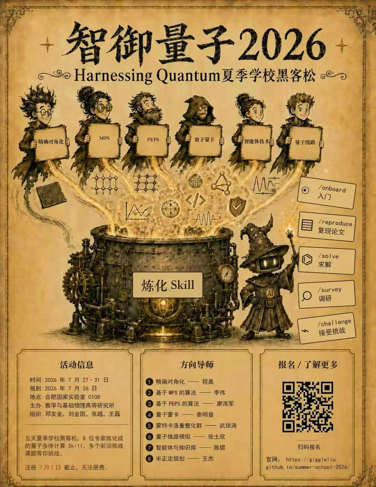
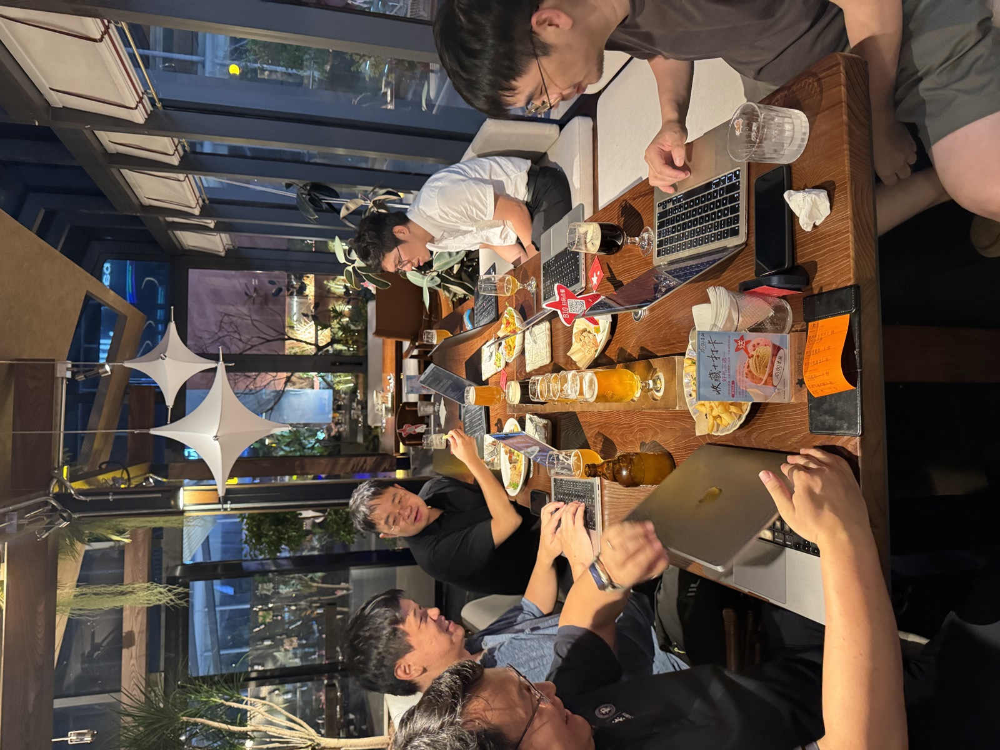

# Harnessing Quantum 2026：散记

*王磊*

*2026 年 7 月*

这是一次“大型拔苗助长人体实验”。四天，一百多个参与者，从本科生到博士生。十余位量子多体计算方向的导师提供了一些开放研究问题作为挑战题，以 [issue](https://github.com/QuantumBFS/quantum.harness/issues) 的形式发布在 GitHub 上——比如量子最优控制方案设计、无费米子符号问题模型的搜索、量子格点问题临界点的猜想。参赛者按照一到三人组队，认领挑战题之后，在 AI 的协助下发起挑战，目标是获得有意义（被出题导师认可）的成果，以 [PR](https://github.com/QuantumBFS/quantum.harness/pulls) 的方式提交。

量子多体物理领域开放性的问题，并不像数学问题那么容易验证；同时，由于前提假设、计算精度等因素的干扰，不存在绝对的是与非。加之我们甚至允许同学们自由推广问题，如何判定研究的科学意义，也成了一个开放的问题。为此，我们安排了导师四天全程在场，随时答疑解惑。周四晚所有队伍提交后，导师连夜评审几十个 PR，选出八个队伍周五上午登台报告，从其中评出四组赠予奖品 Mac mini。

从最终成果上看，很难说这是一次成功的比赛。我并没有看到期待中让我眼前一亮的成果。[^1]当然，AI 的深度参与也给导师们的评审出了难题：几十个 PR，要在短时间内判断正确性和价值，我自己也只好大量借助 AI 初筛总结。这难免有些遗漏——事实上，我明确地知道有一些目前还不显眼、却极具潜力的进展没有被选中。

> “垂死病中惊坐起，八强竟是我自己”

在这几天里，学生的心态也发生了有意思的分化。一端自信满满，觉得有 AI agent 加持可以横扫所有问题；另一端躺平摆烂——反正都是 AI 做的，我不懂也没啥乐趣。当收到入选八强、需要登台报告的通知时，不止一组同学表现出“为什么被选中的是我”的惊讶：他们其实自己也还没完全消化 AI 带着他们得到的结果，更说不清这些结果究竟是好还是坏。[^2]

> 明明这是一个非常富有教学意义的 project，我却没有自己深度参与决策和学习算法，而是交给 ai 了，这让我感到浪费。
>
> 我事实上需要自己动手去做，或指导ai去做，而一边理解的过程才是快乐的，但我屈服于自己身上的惰性，以及对于要在三天内完成这一切的恐惧，把一切交给了 AI，心想“等有空了再理解也不迟”。（刘金国老师说：ai允许我们先做再想）

同学的总结和引用值得玩味。“先做再想”在有经验的研究者手里是效率利器：他们有能力验证做出来的东西，有图像去解读结果，而且做完之后真的会回头去想。而在初学者手里，同一句话反而成了麻醉剂——“等有空了再理解”的那一天多半不会到来，本该用来训练自己的过程外包给了 AI，剩下的只是一堆自己无法判断好坏的结果。利器与麻醉剂的分界，一句流传很广的格言说得最透：“思考可以外包，但理解不能”[^3]。有经验的研究者外包了思考、留下了理解；初学者往往连理解也一并外包了。

复盘下来有个规律：那些出题者的目标没有定得很宏大、可以按部就班推进的课题，同学们基本做得挺好；而那些需要较多算力和耐心，不便于快速迭代的课题，参赛者普遍表现不好。难怪有同学发出“选择比努力更重要”的感慨。而对于真正有挑战的开放课题，大多数同学选择了让 AI 带着走。

被 AI 带着走了几天之后，还算值得庆幸的是，最后的汇报是面对面的。人从屏幕后面走出来，大多数同学表现得极度坦诚——没理解就是没理解，并没有不懂装懂。几天下来，题目虽然感觉没做出来，但还是交了朋友、享受了美食。

对此，最后评选时导师能做的，也就是奖励求索、奖励人性、奖励坦诚，而不只是奖励结果。因为反正结果正在变得廉价，真诚反而显得更加可贵。回头看，最终获奖的几个队伍，评审都能看清他们如何一步步跟着 AI 理解、推进、解决问题，或者至少做出了尝试理解的努力。

> 感觉在这种 ddl 催促的情况下，学生对课题无法有充分的认识，很容易变得浮躁起来，变成 agent 的奴隶。又因为这是比赛的形式，或许会觉得接受过多导师的指导会对其他同学不太公平？而导师指导恰恰非常关键，普通学生是没有对ai的输出有足够的判断力的。希望老师们可以给出心理疏导和建议，作为学生应该如何使用ai，如何在现在这个时代还能不断进步成为一个领域的专家。

从教学的目的看，讽刺的是：我们意图传授的 agent 技能，对一部分同学而言，削弱了而不是放大了科研的乐趣。这次最大的教训：竞赛的形式和 ddl 的催促剥夺了这部分同学的成就感。[^4]奖品不是一个好的信号，它让人误以为活动的目的是分出胜负，而忽视了成长和交流。

这场活动也是 AI 时代科研生态的一面镜子。导师们的评选会漏掉具有潜力但不够 sexy 的实质性进展，其实也反映了目前学术发表的窘境。无论在比赛中还是实际科研中，都有人广度优先，通过批量筛选 low-hanging fruit 来工业化地生产结果；也有人深度优先，专注于具体的、更有挑战的研究。平心而论，在目前的情况下，后者显得有点吃亏。

虽然效率堪忧，但就个人品味而言，还是后一类的研究带给我的乐趣最大。对于问卷里那位同学的提问，这是我能给出的部分回答：要把这类深度优先的科研做好，需要的是拆解问题、组织布局的能力——把难以解决的问题拆解成适合现阶段 AI 处理的子问题，再步步为营，通过验证逐步推进；此外，更应该注重培养物理图像和全局思维——尝试走出纯数字的世界，回到实际体系，追问物理问题的现实含义。[^5]以此勉励同学们，也勉励自己。

最后，这次活动还纠正了我的一个误区。之前我一直觉得，学做研究就像学游泳，悟性好的学生扔到水里就行——何况现在还配上了最好的 AI 游泳圈。但现在我觉得，频繁的师生互动是非常有必要的：信念、价值观、品味，都只能通过言传身教来传承，而不能指望现阶段的 AI。这次活动对我自己而言，最值得回忆的也还是人与人之间的鼓励和相互启发。

[^1]: 当然，这不排除同学们在 AI 加持下海量的提交中还包含着金子，只是筛选出它们的成本太高了。

[^2]: 甚至，某个对自己要求极高的同学在汇报当天逃离了现场，把 AI 留下的烂摊子转手丢给了懵懂的师弟们。

[^3]: <https://x.com/karpathy/status/2049907410303865030>

[^4]: 有些同学甚至心态崩了，陷入对自己价值的全盘否定。希望他们尽快走出来，找到目标，走出迷茫。

[^5]: 关于如何使用 AI agent 开展研究的更多建议，可参考 [AI Agents and Your Research](teaching-post.html?p=ai-agent-research)（IOP，2026 年 1 月）和讲座幻灯片 [LLM and Agentic AI](lectures/LLM-Agent.pdf)（Harnessing Quantum 2026）。
