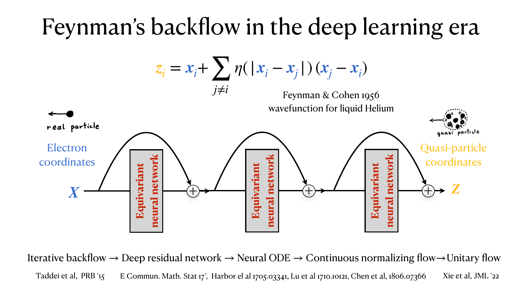
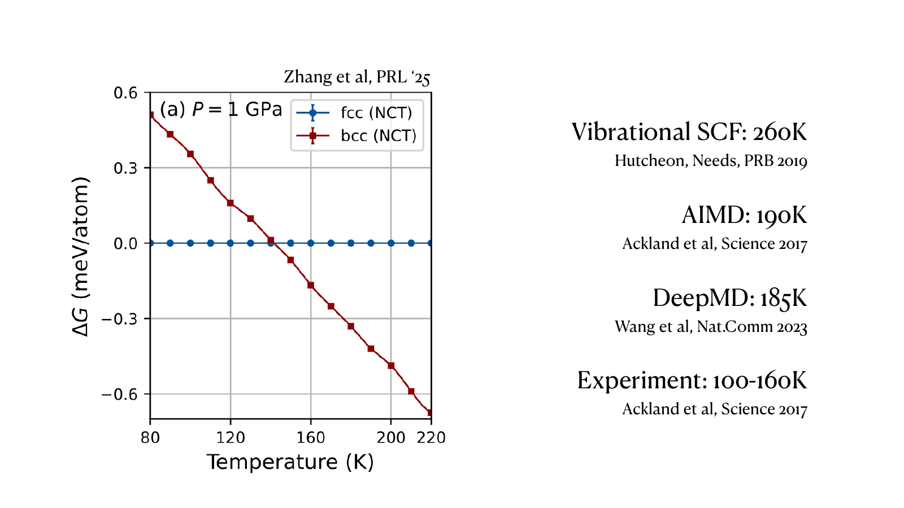
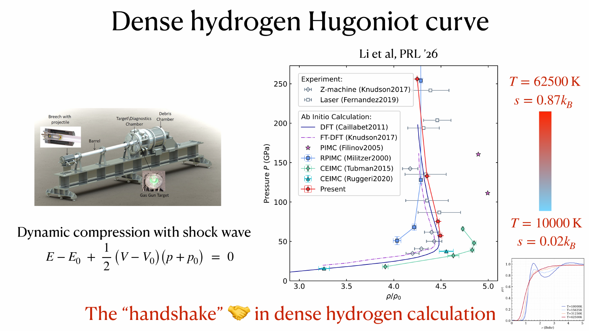
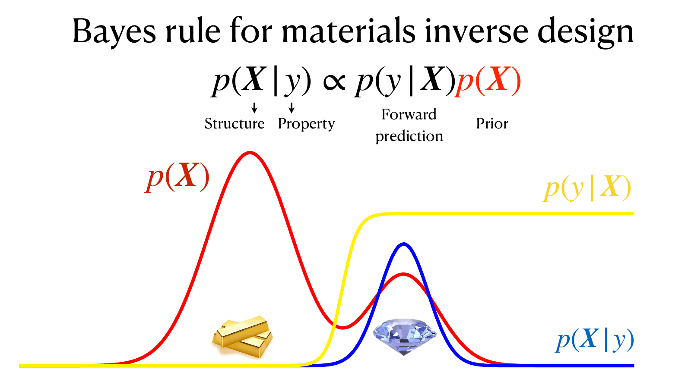

# Minimizing Free Energy: From Nature to Large Language Models

*Lei Wang*

*April 2026*

---

An ice cube melts on a warm countertop. A protein folds. Electrons in a metal settle into a Fermi liquid at high density and into a Wigner crystal at low density. In each case Nature is quietly running an optimization — minimizing the free energy

$$F = E - TS,$$

the energy minus temperature times entropy. Write that on the left of a blackboard. On the right, write the post-training objective of a modern large language model,

$$\mathcal{F}[q_\theta] = \mathbb{E}_{X \sim q_\theta(X)}\!\left[-r(X)\right] + \tau\,\mathrm{KL}\!\left(q_\theta(X) \,\|\, p(X)\right),$$

with reward $r$, pre-trained reference distribution $p$, and inverse-temperature parameter $\tau$. The reward plays the role of (minus) the energy, the KL regularizer plays the role of (minus) the entropy measured against $p$, and $q_\theta$ — the distribution your fine-tuned model samples from — plays the role of the density matrix $\rho$. The loss that OpenAI and DeepSeek pay GPUs to minimize is the loss that Nature minimizes for free.

This post is about why that coincidence is less of a coincidence than it looks — and why generative AI is the tool that finally lets us minimize free energy in cases where physicists have been stuck for decades.

## The variational free energy principle

Free energy is useful to know. Phase transitions, reaction rates, the melting temperature of a quantum solid, the equation of state of dense hydrogen inside Jupiter — all are questions about $F$. But computing it from first principles is usually hopeless. The partition function $Z = \int dX\, e^{-\beta E(X)}$ is a high-dimensional integral dominated by exponentially small regions, and $F = -k_B T \ln Z$ is only as tractable as $Z$. For quantum systems things are worse: $Z$ becomes a path integral, and many interesting Hamiltonians suffer from a fermion sign problem that destroys any hope of a direct Monte Carlo estimate.

The classical workaround is the Gibbs–Bogolyubov–Feynman variational principle:

$$F \leq F[\rho] = \mathrm{Tr}(H\rho) + k_B T\,\mathrm{Tr}(\rho \ln \rho),$$

for any trial density matrix $\rho$. Minimize the right-hand side over a family of $\rho$'s and you get a rigorous upper bound on the true $F$ and, as a byproduct, an approximation to the thermal state itself. Elegant on paper. In practice, Richard Feynman spent part of his 1987 lecture *Difficulties in Applying the Variational Principle to Quantum Field Theories* explaining why the principle is, in his words, "no damn good at all" for serious problems.[^1] He named three difficulties, and they set the agenda for everything that follows:

1. **Expressibility.** The trial $\rho$ must be simple enough to compute with. Historically that meant Gaussian states, mean-field products, and Hartree–Fock determinants — families too narrow to capture strongly correlated physics.
2. **Optimization.** Even when the family is expressive enough in principle, minimizing $F[\rho]$ over its parameters is a high-dimensional non-convex problem. Feynman worried specifically about sensitivity to high-frequency modes in field theory, but the concern is generic.
3. **Sampling.** Evaluating $\mathrm{Tr}(H\rho)$ and $\mathrm{Tr}(\rho \ln \rho)$ requires integrating over field configurations. "We still have to do a functional integral," Feynman noted — and if we could do *that*, we would not have needed a variational principle to begin with.

For thirty years these objections were well-founded, and the variational free energy principle received, as of the time of this writing, a few dozen citations in the QFT literature — compared with five-figure citations for Feynman's 1981 *Simulating Physics with Computers*. What has changed is that we now have a machine — the modern generative model — that answers all three of Feynman's difficulties at once.

## How generative models answer Feynman

**Expressibility.** An autoregressive neural network with a few hundred million parameters is a universal approximator for distributions over discrete or continuous sequences. It does not impose Gaussianity, does not demand a mean-field factorization, and does not require the physicist to guess the right ansatz in advance. The trial distribution $q_\theta$ is *learned*, not written down. That alone dissolves Feynman's first objection.

**Optimization.** This is the subtle one, and it is the subject of a [companion post](teaching-post.html?p=unreasonable-effectiveness-genai). The short version: minimizing over the parameters $\theta$ of a neural network is, counterintuitively, *easier* than minimizing over the configurations $X$ of the physical system. A single parameter typically controls many output variables, so a gradient step in $\theta$-space is a coordinated nonlocal move in configuration space. Nonlocal moves can cross barriers that local ones cannot. The landscape in $\theta$-space is empirically smoother than the rugged configuration-space landscape physicists have been fighting since the earliest Monte Carlo papers.

**Sampling.** An autoregressive model is *tractable by construction*. Drawing $X \sim q_\theta(X)$ is ancestral sampling — sample $x_1$, then $x_2$ given $x_1$, and so on — which costs one forward pass per token. The probability $q_\theta(X)$ of any sample is available in closed form as a product of conditionals, so the entropy term $-\langle \ln q_\theta \rangle$ is estimable directly from the same batch of samples used to estimate the energy term. Feynman's third difficulty, that one still has to do the functional integral, is met by a model that was *designed* to make that integral easy.

Put these together and the Gibbs–Bogolyubov–Feynman bound is back in business: the trial distribution is universal, the parameter landscape is benign, and every expectation in $F[\rho]$ is computable from model samples. What used to be a principle in search of a tractable ansatz is now a working numerical method.

## Three faces, one cost function

With that toolkit in hand, look back at $F[\rho] = E - TS$ and notice how many problems it covers.

**Atomic-scale thermodynamics.** Neural autoregressive ansätze for the many-body density matrix, optimized directly against the variational free energy, give non-perturbative access to the thermodynamics of the homogeneous electron liquid,[^2] the structure of quantum solids,[^3] and the equation of state of dense hydrogen relevant for giant-planet interiors.[^4] In each case there is no training dataset. The objective $F[\rho]$ is handed to you by Nature; you minimize it by sampling from $q_\theta$, scoring with the Hamiltonian, and back-propagating.

The ansatz contains a language model in disguise. The variational density matrix factorizes as $\rho = \sum_{K} U \,|\Phi_K\rangle\, p_K \,\langle \Phi_K|\, U^\dagger$: a classical probability $p_K$ over which single-particle orbitals are occupied, and a unitary $U$ that dresses the bare basis states into interacting ones. The probability $p_K$ is an autoregressive model over occupied orbitals — for the electron liquid, a "sentence" whose tokens are momenta. The unitary $U$, meanwhile, is realized as a normalizing flow between particle and quasiparticle coordinates — and that flow has a physics ancestor. In 1956, Feynman and Cohen improved the trial wavefunction of liquid helium by displacing each particle's coordinate by a function of its neighbors' positions, a device they called backflow.[^8] Iterate the displacement and you have a deep residual network; take the continuum limit and you have a neural ODE, which is a continuous normalizing flow. The machinery that overcomes Feynman's 1987 objections descends in part from an ansatz Feynman wrote down three decades before raising them.

The same machinery settles a textbook question about solid lithium: is the ground-state structure bcc or fcc? The two structures are separated by a fraction of a meV per atom, and lithium's light nuclei oscillate with large amplitude, so quantum anharmonicity matters. A neural canonical transformation for lattice dynamics — an autoregressive model over roughly ten million phonon excited states of ~500 atoms, composed with a normalizing flow — resolves the competition directly in the free energy: quantum anharmonicity stabilizes bcc, and the predicted bcc–fcc transition at 1 GPa lands near 140 K, inside the experimental window of 100–160 K, where earlier estimates ranged from 185 to 260 K.[^3]

Warm dense hydrogen pushes the construction one level deeper. Between the plasma and the molecular liquid, protons are classical while electrons are quantum degenerate, so the calculation jointly optimizes three nested generative models: a normalizing flow for the proton positions, an autoregressive model for the electron energy levels given the protons, and another flow for the electron states themselves.[^4] The resulting Hugoniot curve — the locus of states reached by shock compression — runs through the Z-machine and laser experiments, a handshake between theory and experiment in a regime where earlier ab initio methods scattered. The equation of state feeds directly into the hydrodynamic simulations of giant-planet interiors and inertial-confinement fusion.

**LLM post-training.** The RL fine-tuning objective

$$\mathcal{F}[q_\theta] = \mathbb{E}_{X \sim q_\theta(X)}\!\left[-r(X)\right] + \tau\,\mathrm{KL}\!\left(q_\theta(X) \,\|\, p(X)\right)$$

is $E - TS$ with $E = -r$ and entropy measured *relative* to the pre-trained reference $p(X)$ at temperature $\tau$. Minimizing it produces a distribution that concentrates probability on high-reward trajectories without collapsing onto a single mode — which is exactly what a thermal state does, concentrating on low-energy configurations without collapsing onto the ground state. Pre-training provides the prior $p$; post-training tilts that prior by a Boltzmann factor $e^{r/\tau}$. The two phases are two sides of the same coin, distinguished by the direction of a KL divergence: pre-training minimizes the forward $\mathrm{KL}(\text{data} \,\|\, p)$, pulling the model toward the world, while post-training minimizes the reverse $\mathrm{KL}(q \,\|\, p\,e^{r/\tau})$, pulling the model toward a Boltzmann-tilted version of itself.

**Materials inverse design.** Bayes' rule,

$$\underbrace{p(X|y)}_{\text{posterior}} \;\propto\; \underbrace{p(X)}_{\text{prior}}\,\underbrace{p(y|X)}_{\text{likelihood}},$$

is another face of the same object. Sampling from the posterior is variationally equivalent to minimizing

$$\mathbb{E}_{X \sim q_\theta(X)}\!\left[-\ln p(y|X)\right] + \mathrm{KL}\!\left(q_\theta(X) \,\|\, p(X)\right),$$

i.e., an energy that rewards good predicted properties $y$ and a KL that keeps $q_\theta$ close to the prior of physically plausible structures.

A picture makes the division of labor plain. The prior $p(X)$, trained on the world's known crystals, puts most of its probability on ordinary materials — gold is common, diamond is rare. The likelihood switches on only where the target property holds. Their product concentrates the posterior on the rare structures that are both chemically sensible and functionally right.

The prior is not a decoration. Google's DeepDream experiment of 2015 showed what likelihood maximization does without one: ascend the gradient of $p(\text{dog} \mid \text{pixels})$ over raw pixels and you do not get a photograph of a dog — you get a hallucinated sky full of dog faces, an image the classifier loves and no camera would produce. The KL term is what keeps generated crystals on the manifold of plausible chemistry rather than in the adversarial corners of the property predictor, just as the KL regularizer in LLM post-training keeps the fine-tuned model from collapsing onto degenerate, reward-hacked outputs.[^9]

CrystalFormer-RL does exactly this, reinforcement-fine-tuning a pre-trained space-group–informed transformer prior[^5] to produce crystals maximizing the product of band gap and dielectric constant.[^6] The two properties fundamentally conflict — wider gaps generally come with smaller dielectric constants — which is what makes the search nontrivial. Starting from a generic crystal generator, the procedure discovers candidates such as $\mathrm{Cs}_2\mathrm{LiLuF}_6$ and $\mathrm{CsCaF}_3$ with $E_g > 6.9\,\mathrm{eV}$ and $\varepsilon_{\mathrm{elec}} > 2.3$ — both above the convex hull and absent from the training distribution.

The same functional also runs in the direction of analysis rather than synthesis. Reinterpret the reward as goodness-of-fit to a measured X-ray diffraction pattern, and crystal-structure determination becomes maximum-entropy inference with a learned crystal prior — a welcome reformulation, since the fit landscape is demonstrably too rough for gradient descent.[^10]

Three problems, three communities, one minimization. The objective is $E - TS$; the prior differs (a pre-trained LLM, a Hamiltonian, a crystal generator); the energy differs (negative reward, Hamiltonian expectation, negative log-likelihood); the sampler is always an autoregressive $q_\theta$. Same objective, same model class, same algorithm.

## Coda: from Bit to It

John Wheeler's slogan *It from Bit* — that every physical entity derives its existence from information-theoretic yes-or-no answers[^7] — was a metaphysical provocation in 1989. In 2026 it reads almost like a design document. Train an autoregressive model to predict bits — tokens of text, bytes of an image, atomic coordinates of a crystal — and by the time you have minimized the free energy of the prediction problem, you have built something that produces It: working code, photorealistic images, stable materials, calibrated qubits.

The [companion post](teaching-post.html?p=unreasonable-effectiveness-genai) argues that three stages — representation, optimization, and sampling — are all the pipeline needs, and that each stage transports across modalities that share no physical mechanism. Read alongside the variational free energy story above, the two posts describe the same pipeline from two angles: one from the perspective of a machine-learning practitioner noticing that autoregressive models work unreasonably well, the other from the perspective of a physicist noticing that $E - TS$ is what the practitioner was minimizing all along.

Whether one is computing the free energy of a quantum solid, post-training a language model, or designing a dielectric crystal, the hard part used to be writing down a tractable trial distribution. That part is now done for us.

## Acknowledgments

The author thanks Zhendong Cao, Hao Xie, and Shigang Ou for discussions that shaped the perspective in this post.

---

## References

[^1]: Transcript of R. P. Feynman's 1987 talk, *Difficulties in Applying the Variational Principle to Quantum Field Theories*. Contrast with the citation trajectory of his 1981 *Simulating Physics with Computers*, which has accumulated tens of thousands of citations in the same period.

[^2]: Variational free energy calculations for the homogeneous electron liquid with neural autoregressive ansätze: Xie et al., *Journal of Machine Learning* (2022); and SciPost Physics (2023).

[^3]: Quantum solid structure via variational free energy: *Journal of Chemical Physics* (2024) and *Physical Review Letters* (2025).

[^4]: Dense hydrogen equation of state: *Physical Review Letters* (2023) and *Physical Review Letters* (2026).

[^5]: Cao, Luo, Lv, and Wang, "Space Group Informed Transformer for Crystalline Materials Generation", Science Bulletin (2025). https://arxiv.org/abs/2403.15734

[^6]: Cao and Wang, "CrystalFormer-RL", *Physical Review B* (2026). Code: https://github.com/deepmodeling/crystalformer

[^7]: J. A. Wheeler, "Information, Physics, Quantum: The Search for Links" (1989).

[^8]: Feynman and Cohen, "Energy Spectrum of the Excitations in Liquid Helium", Physical Review 102, 1189 (1956).

[^9]: Korbak, Perez, and Buckley, "RL with KL penalties is better viewed as Bayesian inference", arXiv:2205.11275 (2022). https://arxiv.org/abs/2205.11275

[^10]: Segal, Subramanian, Li, Miller, and Gómez-Bombarelli, "The loss landscape of powder X-ray diffraction-based structure optimization is too rough for gradient descent", Digital Discovery (2026). https://doi.org/10.1039/d6dd00017g
