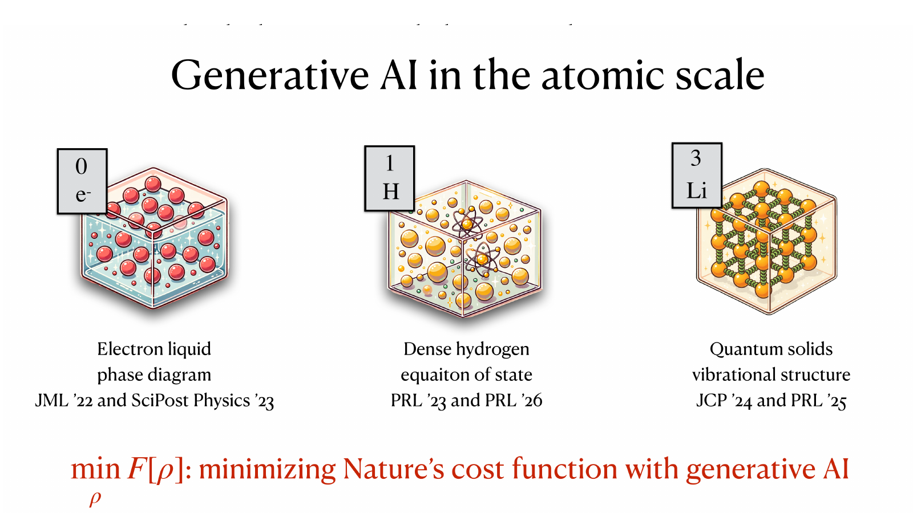
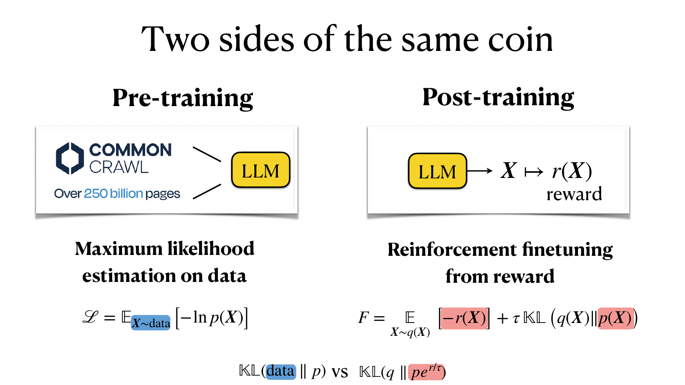
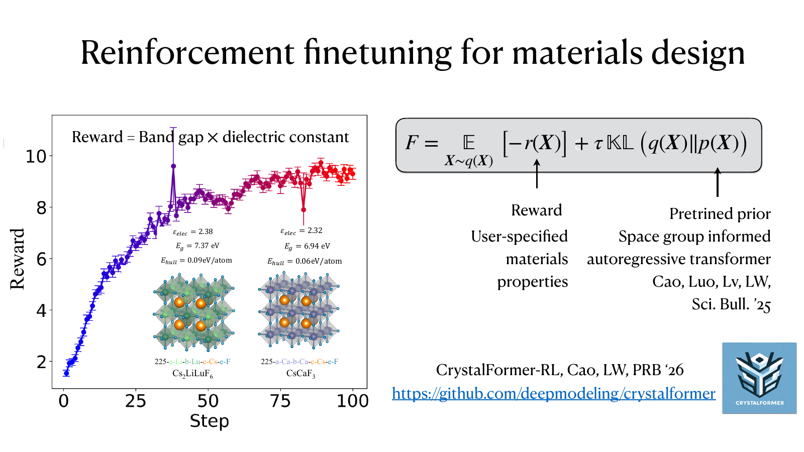
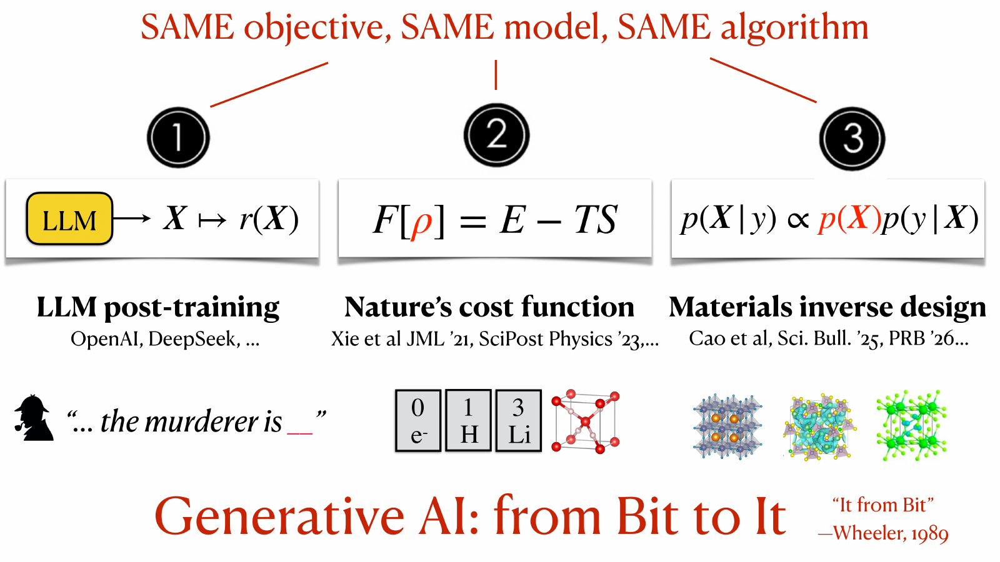

# Variational Free Energy: Nature's Cost Function and Large Language Models

*Lei Wang*

*April 2026*

---

An ice cube melts on a warm countertop. A protein folds. Electrons in a metal settle into a Fermi liquid at high density and into a Wigner crystal at low density. In each case Nature finds, given time, the state that minimizes the free energy

$$F = E - TS,$$

the energy minus temperature times entropy.

The same cost function, it turns out, is what a large language model minimizes when it is fine-tuned from a reward, and what a generative model minimizes when it designs a crystal. This post follows the principle from Feynman's complaint about it in 1987 to the training of language models: why it sat unpopular for decades, what generative AI changed, and how the machinery that now writes text and paints images, pointed at electrons and atoms, becomes generative AI for the physical world.

## The variational free energy principle

Free energy is useful to know. Phase transitions, reaction rates, the melting temperature of a quantum solid, the equation of state of dense hydrogen inside Jupiter — all are questions about $F$. But computing it from first principles is usually hopeless. The partition function $Z = \int dX\, e^{-\beta E(X)}$ is a high-dimensional integral dominated by exponentially small regions, and $F = -k_B T \ln Z$ is only as tractable as $Z$. For quantum systems things are worse: $Z$ becomes a path integral, and many interesting Hamiltonians suffer from a fermion sign problem that destroys any hope of a direct Monte Carlo estimate.

The classical workaround is the Gibbs–Bogolyubov–Feynman variational principle:

$$F \leq F[\rho] = \mathrm{Tr}(H\rho) + k_B T\,\mathrm{Tr}(\rho \ln \rho),$$

for any physical trial density matrix $\rho$. Minimize the right-hand side over a family of $\rho$'s and you get a rigorous upper bound on the true $F$ and, as a byproduct, an approximation to the thermal state itself. It is the finite-temperature member of a family: at zero temperature the same logic is the Rayleigh–Ritz bound on the ground-state energy, and for real-time evolution the Dirac–Frenkel principle plays the same role. In every case a physical principle supplies the objective, and a trial state is all one has to provide.

Elegant on paper. In practice, Richard Feynman spent part of his 1987 lecture *Difficulties in Applying the Variational Principle to Quantum Field Theories* explaining why the principle is, in his words, "no damn good at all" for serious problems. He named three difficulties, and they set the agenda for everything that follows:

1. **Expressibility** — his *"Only Gaussian Trial States."* The trial $\rho$ must be simple enough to compute with. Historically that meant Gaussian states, mean-field products, and Hartree–Fock determinants — families too narrow to capture strongly correlated physics.
2. **Optimization** — his *"Sensitivity to High Frequencies."* Even when the family is expressive enough in principle, minimizing $F[\rho]$ over its parameters is a high-dimensional non-convex problem. Feynman worried specifically about high-frequency modes in field theory, but the concern is generic.
3. **Sampling** — his *"We Still Have To Do a Functional Integral."* Evaluating $\mathrm{Tr}(H\rho)$ and $\mathrm{Tr}(\rho \ln \rho)$ requires integrating over field configurations. And if we could do *that*, we would not have needed a variational principle to begin with.

Compare the two verdicts Feynman delivered six years apart. On building a quantum computer to simulate physics, in 1981: "it doesn't look so easy." On the variational principle, in 1987: "it is no damn good at all!"[^1] The harder-sounding project got the milder warning, and a field grew up around it. The principle got the dismissal, and for nearly four decades the dismissal was fair. What has changed is that we now have a machine — the modern generative model — that answers all three difficulties at once.

## Generative models answer Feynman

**Expressibility.** An autoregressive neural network with a few hundred million parameters is a universal approximator for distributions over discrete or continuous sequences. It does not impose Gaussianity, does not demand a mean-field factorization, and does not require the physicist to guess the right ansatz in advance. The trial distribution $q_\theta$ is *learned*, not written down. That answers Feynman's first objection, at least in principle.

**Optimization.** Feynman's worry was that the landscape is treacherous. What makes it navigable is less a better optimizer than a better metric. A step $\delta\theta$ should be measured by how much it moves the *distribution*, $\mathrm{KL}(q_\theta \,\|\, q_{\theta+\delta\theta})$, rather than by its Euclidean length in parameter space; preconditioning the gradient with the Fisher information matrix does exactly that. Amari called it the natural gradient.[^12] Sorella derived the same update independently for variational Monte Carlo as stochastic reconfiguration, with the quantum geometric tensor as the metric.[^13] What has changed since is scale. Kronecker-factored approximations of the Fisher matrix,[^14] the minSR trick of inverting a sample-by-sample matrix instead of a parameter-by-parameter one,[^15] and subsampled Gauss–Newton solvers[^16] carry the method to networks with millions of parameters. Why the parameter landscape is friendlier than the configuration landscape in the first place — a single parameter moves many configurations at once — is the subject of a [companion post](teaching-post.html?p=unreasonable-effectiveness-ar).

**Sampling.** The entropy is the term that kept the principle on the shelf. Estimating $\mathrm{Tr}(\rho \ln \rho)$ from samples requires $\ln \rho$ itself, and for that $\rho$ must be normalized — otherwise $\ln \rho$ is off by an unknown $\ln Z$, which is the very quantity we set out to compute. An energy-based model buys its flexibility by giving up exactly this. Autoregressive models and normalizing flows are normalized by construction: a product of conditionals sums to one, and a change of variables tracks its own Jacobian. Both also sample directly — ancestral sampling token by token, or Gaussian noise pushed through the flow — with no Markov chain, no autocorrelation, no equilibration to wait for. Every sample therefore arrives with its own $\ln q_\theta(X)$ attached, and the entropy is estimated from the same batch as the energy. The quantum case asks for one more thing. Writing $\rho = \sum_K p_K \,|\Psi_K\rangle\langle\Psi_K|$, the identity $\mathrm{Tr}(\rho \ln \rho) = \sum_K p_K \ln p_K$ holds only if the $|\Psi_K\rangle$ are orthonormal, so the map from bare to interacting states must be unitary. A flow whose Jacobian is tracked is precisely such a map. Feynman's functional integral has not gone away; it has been delegated to a model built so that it costs a forward pass.

Put these together and the Gibbs–Bogolyubov–Feynman bound is back in business: the trial distribution is universal, the optimizer respects the geometry of distributions, and every expectation in $F[\rho]$ — entropy included — is computable from direct samples. What used to be a principle in search of a tractable ansatz is now a working numerical method.

## Nature's cost function, minimized

Neural autoregressive ansätze for the many-body density matrix, optimized directly against the variational free energy, give non-perturbative access to the thermodynamics of the homogeneous electron liquid,[^2] the structure of quantum solids,[^3] and the equation of state of dense hydrogen relevant for giant-planet interiors.[^4] In each case there is no training dataset. The objective $F[\rho]$ is handed to you by Nature; you minimize it by sampling from $q_\theta$, scoring with the Hamiltonian, and back-propagating.

This is reinforcement learning with a verifiable reward in the strictest sense. Lower is better, and overfitting in the usual sense does not arise, because the bound holds for every trial state. The constraints are unforgiving — exact symmetries, fermion antisymmetry, strong coupling, and accuracy demands at the level of a milli-electronvolt per atom — which makes quantum many-body physics a stress test for the whole approach. And rather than consuming data, such a calculation produces it: every converged free energy is a new benchmark number.

The ansatz contains a language model in disguise. The variational density matrix factorizes as $\rho = \sum_{K} U \,|\Phi_K\rangle\, p_K \,\langle \Phi_K|\, U^\dagger$: a classical probability $p_K$ over which single-particle orbitals are occupied, and a unitary $U$ that dresses the bare basis states into interacting ones. The probability $p_K$ is an autoregressive model over occupied orbitals — for the electron liquid, a "sentence" whose tokens are momenta. The unitary $U$ is a normalizing flow between particle and quasiparticle coordinates, and that flow has a physics ancestor: in 1956, Feynman and Cohen improved the trial wavefunction of liquid helium by displacing each particle's coordinate by a function of its neighbors' positions, a device they called backflow.[^8] Iterate the displacement and you have a deep residual network; take the continuum limit and you have a continuous normalizing flow. The machinery that overcomes Feynman's 1987 objections descends in part from an ansatz Feynman wrote down three decades before raising them.

The same machinery settles a textbook question about solid lithium: is the ground-state structure bcc or fcc? The two structures are separated by a fraction of a meV per atom, and lithium's light nuclei oscillate with large amplitude, so quantum anharmonicity decides the answer. A neural canonical transformation for lattice dynamics — an autoregressive model over phonon excited states composed with a normalizing flow — resolves the competition directly in the free energy, and brings the predicted transition temperature into the experimental window, where earlier estimates had sat well above it.[^3]

Warm dense hydrogen pushes the construction one level deeper. Between the plasma and the molecular liquid, protons are classical while electrons are quantum degenerate, so the calculation jointly optimizes nested generative models for the proton positions, the electron energy levels, and the electron states themselves.[^4] The resulting equation of state runs through the shock-compression experiments in a regime where earlier ab initio methods scattered, and feeds directly into the hydrodynamic simulations of giant-planet interiors and inertial-confinement fusion.

## The same cost function fine-tunes a language model

Now look at what a language model minimizes when it is fine-tuned from a reward:

$$\mathcal{F}[q_\theta] = \mathbb{E}_{X \sim q_\theta(X)}\!\left[-r(X)\right] + \tau\,\mathrm{KL}\!\left(q_\theta(X) \,\|\, p(X)\right),$$

with reward $r$, pre-trained reference distribution $p$, and temperature parameter $\tau$. This is $E - TS$ with $E = -r$ and entropy measured *relative* to $p$: the reward plays the role of (minus) the energy, the KL regularizer plays the role of (minus) the entropy, and $q_\theta$ — the distribution the fine-tuned model samples from — plays the role of the density matrix $\rho$. The loss that OpenAI and DeepSeek pay GPUs to minimize is, term for term, the one a physical system minimizes as it equilibrates.

The analogy runs deeper than bookkeeping. Minimizing $\mathcal{F}$ produces a distribution that concentrates probability on high-reward trajectories without collapsing onto a single mode — which is what a thermal state does, concentrating on low-energy configurations without collapsing onto the ground state. Pre-training provides the prior $p$; post-training tilts that prior by a Boltzmann factor $e^{r/\tau}$.

The two phases are therefore two sides of the same coin, distinguished by the direction of a KL divergence. Pre-training minimizes the forward $\mathrm{KL}(\text{data} \,\|\, p)$, pulling the model toward the world. Post-training minimizes the reverse $\mathrm{KL}(q \,\|\, p\,e^{r/\tau})$, pulling the model toward a Boltzmann-tilted version of itself.

## The same cost function designs materials

Bayes' rule,

$$\underbrace{p(X|y)}_{\text{posterior}} \;\propto\; \underbrace{p(X)}_{\text{prior}}\,\underbrace{p(y|X)}_{\text{likelihood}},$$

is a third face of the same object. Sampling from the posterior is variationally equivalent to minimizing

$$\mathbb{E}_{X \sim q_\theta(X)}\!\left[-\ln p(y|X)\right] + \mathrm{KL}\!\left(q_\theta(X) \,\|\, p(X)\right),$$

i.e., an energy that rewards good predicted properties $y$ and a KL that keeps $q_\theta$ close to the prior of physically plausible structures.

The division of labor is plain. The prior $p(X)$, trained on the world's known crystals, puts most of its probability on ordinary materials — gold is common, diamond is rare. The likelihood switches on only where the target property holds. Their product concentrates the posterior on the rare structures that are both chemically sensible and functionally right.

The prior is not a decoration. Google's DeepDream experiment of 2015 showed what likelihood maximization does without one: ascend the gradient of $p(\text{dog} \mid \text{pixels})$ over raw pixels and you do not get a photograph of a dog — you get a hallucinated sky full of dog faces, an image the classifier loves and no camera would produce. The KL term is what keeps generated crystals on the manifold of plausible chemistry rather than in the adversarial corners of the property predictor, just as the KL regularizer in LLM post-training keeps the fine-tuned model from collapsing onto degenerate, reward-hacked outputs.[^9]

CrystalFormer-RL does exactly this, reinforcement-fine-tuning a pre-trained space-group–informed transformer prior[^5] to produce crystals maximizing the product of band gap and dielectric constant.[^6] The two properties fundamentally conflict — wider gaps generally come with smaller dielectric constants — which is what makes the search nontrivial. Starting from a generic crystal generator, the procedure discovers candidates such as $\mathrm{Cs}_2\mathrm{LiLuF}_6$ and $\mathrm{CsCaF}_3$ with $E_g > 6.9\,\mathrm{eV}$ and $\varepsilon_{\mathrm{elec}} > 2.3$ — both above the convex hull and absent from the training distribution.

The same functional also runs in the direction of analysis rather than synthesis. Reinterpret the reward as goodness-of-fit to a measured X-ray diffraction pattern, and crystal-structure determination becomes maximum-entropy inference with a learned crystal prior — a welcome reformulation, since the fit landscape is demonstrably too rough for gradient descent.[^10] Take the spectrum away and what is left is structure prediction: given only a chemical composition, find the structure that minimizes the energy. The energy is then the reward, and the same fine-tuning loop applies.[^11] Two traditions have long divided this labor. Data-driven generators absorb chemical intuition — Pauling's rules and their unwritten cousins — by compressing the world's known crystals; physics-based searches ignore that intuition and grind the energy down directly. The first is fast and usually right, the second slow and, given enough compute, reliable. Composing a pre-trained prior with an energy minimizer is simply running both, in that order.

## Three faces, one cost function

Three problems, three communities, one minimization. The objective is $E - TS$; the prior differs (a pre-trained LLM, the uniform distribution of infinite temperature, a crystal generator); the energy differs (negative reward, Hamiltonian expectation, negative log-likelihood); the sampler is always an autoregressive $q_\theta$. Same objective, same model class, same algorithm.

## Generative AI: from Bit to It

John Wheeler's slogan *It from Bit* — that every physical entity derives its existence from information-theoretic yes-or-no answers[^7] — was a metaphysical provocation in 1989. In 2026 it reads almost like a design document. Train an autoregressive model to predict bits — tokens of text, bytes of an image, atomic coordinates of a crystal — and by the time you have minimized the free energy of the prediction problem, you have built something that produces It: working code, photorealistic images, stable materials, calibrated qubits.

The [companion post](teaching-post.html?p=unreasonable-effectiveness-ar) argues that three stages — representation, optimization, and sampling — are all the pipeline needs, and that each stage transports across modalities that share no physical mechanism. Read alongside the variational free energy story above, the two posts describe the same pipeline from two angles: one from the perspective of a machine-learning practitioner noticing that autoregressive models work unreasonably well, the other from the perspective of a physicist noticing that $E - TS$ is what the practitioner was minimizing all along.

Whether one is computing the free energy of a quantum solid, post-training a language model, or designing a functional material, the hard part used to be writing down a tractable trial distribution. That part is now largely done for us.

## Acknowledgments

The author thanks Zhendong Cao, Hao Xie, and Shigang Ou for discussions that shaped the perspective in this post.

---

## References

[^1]: Transcript of R. P. Feynman's 1987 talk, *Difficulties in Applying the Variational Principle to Quantum Field Theories*. The 1981 quotation is from *Simulating Physics with Computers*, Int. J. Theor. Phys. 21, 467 (1982).

[^2]: Xie, Zhang, and Wang, "Ab-initio study of interacting fermions at finite temperature with neural canonical transformation", *Journal of Machine Learning* 1 (2022). https://doi.org/10.4208/jml.220113 — and "$m^\ast$ of two-dimensional electron gas: a neural canonical transformation study", *SciPost Physics* 14, 154 (2023). https://doi.org/10.21468/SciPostPhys.14.6.154

[^3]: Zhang, Wang, and Wang, "Neural canonical transformations for vibrational spectra of molecules", *Journal of Chemical Physics* 161, 024103 (2024). https://doi.org/10.1063/5.0209255 — and Zhang, Wang, Shi, Ren, Wang, and Wang, "Neural Canonical Transformations for Quantum Anharmonic Solids of Lithium", *Physical Review Letters* 134, 246101 (2025). https://arxiv.org/abs/2412.12451

[^4]: Xie, Li, Wang, Zhang, and Wang, "Deep Variational Free Energy Approach to Dense Hydrogen", *Physical Review Letters* 131, 126501 (2023). https://doi.org/10.1103/PhysRevLett.131.126501 — and Li, Xie, Dong, and Wang, "Deep Variational Free Energy Calculation of Hydrogen Hugoniot", *Physical Review Letters* 136, 076504 (2026). https://arxiv.org/abs/2507.18540

[^5]: Cao, Luo, Lv, and Wang, "Space Group Informed Transformer for Crystalline Materials Generation", Science Bulletin (2025). https://arxiv.org/abs/2403.15734

[^6]: Cao and Wang, "CrystalFormer-RL", *Physical Review B* (2026). Code: https://github.com/deepmodeling/crystalformer

[^7]: J. A. Wheeler, "Information, Physics, Quantum: The Search for Links" (1989).

[^8]: Feynman and Cohen, "Energy Spectrum of the Excitations in Liquid Helium", Physical Review 102, 1189 (1956).

[^9]: Korbak, Perez, and Buckley, "RL with KL penalties is better viewed as Bayesian inference", arXiv:2205.11275 (2022). https://arxiv.org/abs/2205.11275

[^10]: Segal, Subramanian, Li, Miller, and Gómez-Bombarelli, "The loss landscape of powder X-ray diffraction-based structure optimization is too rough for gradient descent", Digital Discovery (2026). https://doi.org/10.1039/d6dd00017g

[^11]: Cao, Ou, and Wang, "CrystalFormer-CSP: Thinking Fast and Slow for Crystal Structure Prediction", arXiv:2512.18251. https://arxiv.org/abs/2512.18251

[^12]: S. Amari, "Natural Gradient Works Efficiently in Learning", Neural Computation 10, 251 (1998). https://doi.org/10.1162/089976698300017746

[^13]: S. Sorella, "Green Function Monte Carlo with Stochastic Reconfiguration", Physical Review Letters 80, 4558 (1998). https://doi.org/10.1103/PhysRevLett.80.4558

[^14]: Martens and Grosse, "Optimizing Neural Networks with Kronecker-factored Approximate Curvature", arXiv:1503.05671 (2015). https://arxiv.org/abs/1503.05671

[^15]: Chen and Heyl, "Empowering deep neural quantum states through efficient optimization", Nature Physics 20, 1476 (2024). https://arxiv.org/abs/2302.01941

[^16]: Ren and Goldfarb, "Efficient Subsampled Gauss-Newton and Natural Gradient Methods for Training Neural Networks", arXiv:1906.02353 (2019). https://arxiv.org/abs/1906.02353
