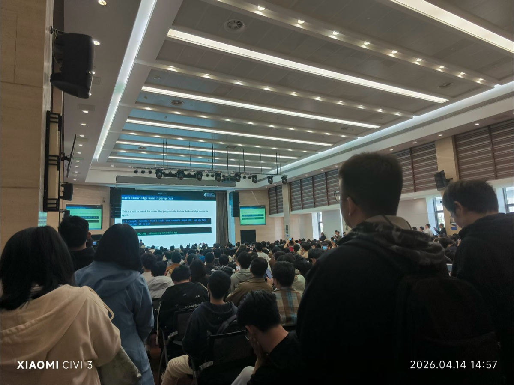

# The Unreasonable Effectiveness of Generative AI

*Lei Wang and AI Agent*

*April 2026*

---

In 1960, Eugene Wigner marveled at "The Unreasonable Effectiveness of Mathematics in the Natural Sciences" — the uncanny fact that abstract structures invented by mathematicians turn out to describe physical reality with startling precision. Almost fifty years later, Halevy, Norvig, and Pereira wrote a sequel of sorts: "The Unreasonable Effectiveness of Data," arguing that simple models trained on enough data beat carefully engineered ones. This post is another installment in that series, written from a physicist's angle. The protagonist this time is generative AI.

Here is the puzzle. A modern generative AI system is, mechanically, a learned probability distribution $p_\theta$ over sequences of tokens, pixels, atomic coordinates, or control pulses. At inference time you just sample: $y \sim p_\theta(y \mid x)$. There is nothing obviously special about that operation. And yet these systems paint photorealistic images of parrots, fold proteins to atomic accuracy, propose stable crystal structures, drive laboratory qubits through calibration routines, and write working code on demand. Why should sampling from a learned distribution do all that?

This post unpacks three surprises. First, the autoregressive factorization that makes language models work turns out to be universal — the same recipe applies across radically different scientific modalities. Second, finding good parameters $\theta$ in a vast, high-dimensional space is, counterintuitively, *easier* than searching over exponentially large configuration spaces directly. Third, once $\theta$ is frozen you do not need to retrain anything: varying only the context $x$ is enough to steer the model toward real scientific tasks.

## Autoregressive Models Beyond Language

Language models work because they factorize the joint distribution over a token sequence using the chain rule of probability, applying it one factor at a time:

$$p(X) = p(x_1)\,p(x_2 \mid x_1)\,p(x_3 \mid x_1, x_2) \cdots$$

The key realization is that this factorization does not care what the tokens are. *Language* becomes a token sequence, a token sequence becomes a bitstream, and a bitstream can represent *anything*. Whatever digital information you can store on a disk, transmit over a network, or read off a sensor is, at some layer of abstraction, a bitstream — text, images, audio, molecular geometries, experimental traces, control pulses, compiled binaries. The autoregressive predictor acts on that layer. So the class of things one can in principle model autoregressively coincides with the class of things one can digitally represent at all, which is extraordinarily general.

**Images.** There is more than one way to serialize an image into a sequence. Visual autoregressive modeling (VAR) reformulates image generation as "next-scale prediction": instead of generating pixels left-to-right, the model predicts a sequence of progressively higher-resolution token maps, each conditioned on all coarser scales that came before.[^1] JPEG-LM goes further and skips the image tokenizer entirely — it trains a language model directly on the raw bytes of a JPEG file, treating the already-compressed image as just another byte sequence to predict one token at a time.[^2] The two approaches differ only in what "token" means. In both cases, the autoregressive machinery is preserved exactly, and coherent images fall out of the same chain-rule predictor that handles text.

**Crystals.** Crystalformer treats crystal structure generation as an autoregressive process over atomic sites: atoms are placed one at a time, with each placement conditioned on the space group, lattice parameters, and all previously placed atoms.[^3] The discrete symmetry constraints of crystallography enter naturally as conditioning information, and the model learns to respect them without any hand-engineered symmetry enforcement.

The takeaway is that no modality-specific architecture is required — the autoregressive machinery transports across domains. This stands in contrast to the tradition in computational physics of building bespoke tools for each problem: tensor networks for spin systems, density functional theory for electronic structure, classical force fields for biomolecular dynamics. Each of those frameworks embeds hard-won physical intuition but is largely confined to its own domain. The same transformer, trained autoregressively on a different kind of sequence, can render a photorealistic landscape or propose a stable crystal — and a range of other scientific objects besides; an earlier [lecture](lectures/AAA-hangzhou2025.pdf) walks through several more. That is the first of this post's three surprises.

## The Untold Secret of Pre-training

A physicist who wants to find a low-energy configuration has, traditionally, searched $3N$-dimensional configuration space for $\min_X E(X)$. Training a generative model does something different: it searches a much larger *parameter* space for $\min_\theta \mathbb{E}_{X \sim p_\theta(X)}[E(X)]$. On the surface this is strictly harder. In practice it is easier, and understanding why is the second surprise.

$$\min_\theta\; \mathbb{E}_{X \sim p_\theta(X)}\!\left[E(X)\right]
\qquad \text{vs.} \qquad \min_X\; E(X)$$

The left-hand side lives in a parameter space that can be hundreds of millions of dimensions, yet is empirically smooth and largely free of the traps that plague physical energy landscapes. The right-hand side lives in a $3N$-dimensional configuration space that is, for any non-trivial system, rugged and crowded with metastable minima — the standard obstruction that motivates replica exchange, parallel tempering, and every other scheme physicists have devised to escape local traps.

**Conjecture.** Pre-training does two things at once, and it is the combination that matters. First, it provides a good *System 1* — in Kahneman's terminology, System 1 is the fast, intuitive mode of cognition; System 2 is the slow, deliberative mode. Here System 1 is the sampler $p_\theta$, which already concentrates probability mass near low-energy, high-quality configurations. When System 1 is good, far less System 2 effort (explicit energy minimization, exhaustive search, rejection sampling) is needed to obtain useful outputs. Second, and more subtly, pre-training learns a representation in which the downstream policy landscape — the objective seen by fine-tuning or reinforcement learning — is itself smoother than it would be in raw configuration space. Fine-tuning navigates a gentler terrain than direct energy minimization ever did.

There is a concrete geometric reason to expect this. A single neural-network parameter typically controls many output variables at once: changing it perturbs many atomic coordinates, or many pixel predictions, in a coordinated way. A step in parameter space is therefore a *nonlocal* move in configuration space, and nonlocal moves can cross energy barriers that local atomic perturbations cannot. Recent work on crystal-structure prediction makes this concrete — reinforcement fine-tuning of a pretrained generative model navigates through exactly these nonlocal moves, and reaches stable structures that random-restart energy minimization would miss.[^4] The old physicist's intuition, that every extra parameter is another degree of freedom to be paid for, is not wrong in general. It is simply measuring the wrong thing. What matters is the geometry of the landscape the optimizer actually sees, and pre-training changes that geometry.

## The Unreasonable Effectiveness of $y \sim p_\theta(y \mid x)$

$$y \sim p_\theta(y \mid x)$$

In deployment, $p_\theta$ is frozen — the weights never change after training ends. Only the context $x$ varies from one task to the next. This sounds unremarkable. It is enough.

Briefly, an agent wraps this sampler in a loop: **observe** the environment, **reason**, **act** via a tool, **verify** the outcome. The context window is exactly the $x$ above — it holds the current goal, the plan, recent outputs, error messages, and whatever has been retrieved. For the full picture see [*AI Agents and Your Research*](teaching-post.html?p=ai-agent-research).

The striking point is the *breadth* of work this loop handles with a single frozen model. The same $p_\theta$ writes prose, debugs code, drives a browser, navigates a terminal — and, increasingly, runs real experiments on real instruments. In each case only $x$ is changing.

A concrete classroom example: the *vibe-coding-for-computational-physics* workshop held at IOP in April 2026 filled the institute's largest lecture hall for the full day. Graduate students wrapped frozen models in thin agent loops and treated writing, reading, and running research code as one continuous conversation — skimming literature through the terminal, sketching numerical experiments, and iterating on results in a single session. The point came through clearly at an event like this: agentic AI is useful, and it is fun.

  
  

The reach extends past the keyboard. Shigang Ou (IOP / DP Tech / BAQIS) is pursuing ongoing work in which an AI agent drives superconducting-qubit calibration directly. For a time-Rabi experiment, the agent writes a pulse schedule, submits it to the control electronics, waits for the oscillation trace, fits the Rabi curve to extract the $\pi$-pulse width, updates the parameter, and submits a verification shot — iterating until calibration converges. Throughout, $p_\theta$ never changes. What changes is only $x$: the conversation history, the latest code, the returned trace, the decision to proceed or retry. The physicist's intuition is that running an experiment requires a trained experimentalist who knows the instrument, the failure modes, and the relevant physics. What this demonstrates is that much of that competence can be encoded in context and iterated at inference time.

That is the third surprise. A frozen $p_\theta$, steered only through $x$, can write, code, use a computer, and run an experiment — without a single gradient update at deployment time. Wigner marveled that mathematics, developed with no particular application in mind, nevertheless describes physical reality. The parallel here is that a distribution trained to predict the next token, with no particular laboratory in mind, nevertheless closes the loop on a qubit calibration experiment. That is the unreasonable part.

## Coda

The three surprises in this post correspond to three stages of the same pipeline: **representation** — an autoregressive model turns any bitstream into a tractable probability distribution (§1); **optimization** — pre-training navigates the parameter landscape more smoothly than direct configuration-space search (§2); and **sampling** — a frozen $p_\theta$, steered only through context, is enough to act on the real world (§3). How these three stages are unified by a single variational free-energy principle is a subject for a future post; an earlier [summer-school lecture](lectures/deepvariationalfreenergy-MLCMP.pdf) covers the variational side in the meantime.

## Acknowledgments

The author thanks Shigang Ou and Zhendong Cao for insightful discussions.

---

## References

[^1]: Tian, Jiang, Yuan, Peng, and Wang, "Visual Autoregressive Modeling: Scalable Image Generation via Next-Scale Prediction", arXiv:2404.02905 (2024). https://arxiv.org/abs/2404.02905

[^2]: Han, Ghazvininejad, Koh, and Tsvetkov, "JPEG-LM: LLMs as Image Generators with Canonical Codec Representations", arXiv:2408.08459 (2024). https://arxiv.org/abs/2408.08459

[^3]: Cao, Luo, Lv, and Wang, "Space Group Informed Transformer for Crystalline Materials Generation", arXiv:2403.15734 (2024). https://arxiv.org/abs/2403.15734

[^4]: Cao, Ou, and Wang, "CrystalFormer-CSP: Thinking Fast and Slow for Crystal Structure Prediction", arXiv:2512.18251 (2025). https://arxiv.org/abs/2512.18251
