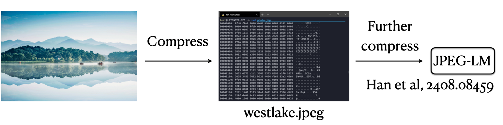
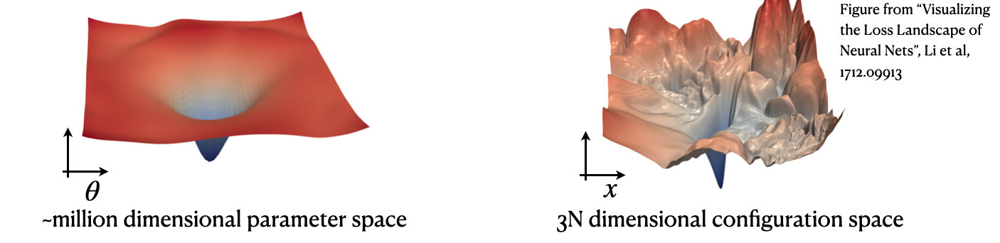
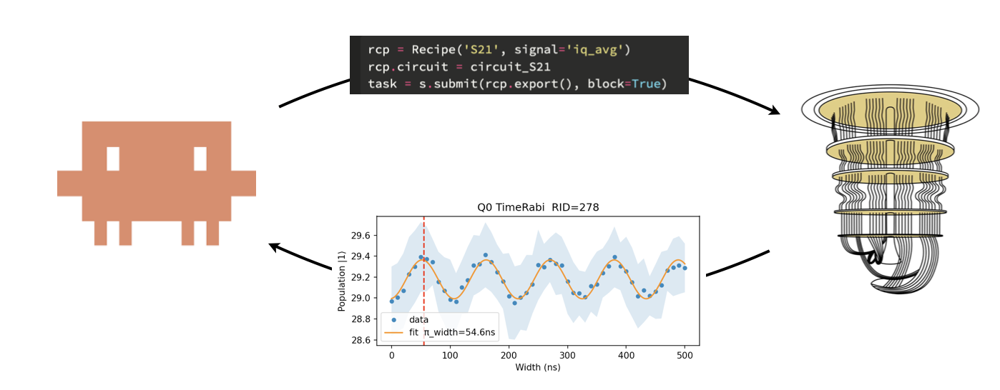

# The Unreasonable Effectiveness of Autoregressive Modeling

*Lei Wang and AI Agent*

*April 2026*

---

An autoregressive model factorizes the joint probability distribution of a high-dimensional variable $X = (x_1, x_2, \ldots, x_N)$ into a product of low-dimensional conditional factors, using the chain rule of probability:

$$p(X) = p(x_1)\,p(x_2 \mid x_1)\,p(x_3 \mid x_1, x_2) \cdots$$

Each factor $p(x_i \mid x_{<i})$ is far easier to model than the full joint — for a language model, $x_i$ is a single token drawn from a finite vocabulary, rather than one of combinatorially many full sequences. Because each factor is separately normalized, the joint is normalized by construction, and sampling reduces to drawing one variable at a time in order. Predicting a conditional distribution is classically called a *regression* task, so iterating this prediction along a sequence is "auto-regression." GPT — Generative Pre-Trained Transformer — is an autoregressive model of exactly this kind, and the same recipe applies to anything one can serialize into a sequence: text, images, crystals, board positions, spin configurations.

Here is the puzzle. A modern generative AI system is, mechanically, a learned probability distribution $p_\theta$ over sequences of tokens, pixels, atomic coordinates, or control pulses. At inference time you just sample: $X \sim p_\theta(X \mid y)$, where $y$ is whatever context the model is conditioned on. There is nothing obviously special about that operation. And yet these systems paint photorealistic images of parrots, fold proteins to atomic accuracy, propose stable crystal structures, drive laboratory qubits through calibration routines, and write working code on demand. Why should sampling from a learned distribution do all that?

This post unpacks three surprises. First, the autoregressive factorization that makes language models work turns out to be universal — the same recipe applies across radically different scientific modalities. Second, finding good parameters $\theta$ in a vast, high-dimensional space is, counterintuitively, *easier* than searching configuration space directly. Third, once $\theta$ is frozen you do not need to retrain anything: varying only the context $y$ is enough to steer the model toward real scientific tasks.

## Autoregression Generalizes Beyond Language

The chain-rule factorization above was invented for language, where each $x_i$ is the next word given its predecessors. The key realization is that this factorization does not care what the tokens are. *Language* becomes a **token sequence** the moment a tokenizer — BPE, WordPiece, or raw bytes — chops a character stream into a finite vocabulary of discrete pieces. A **token sequence** becomes a **bitstream** because each token is an integer, and every integer is a bit pattern. And a **bitstream can represent anything**: whatever you can store on a disk, transmit over a network, or read off a sensor is, at some layer of abstraction, a bitstream — text, images, audio, molecular geometries, experimental traces, control pulses, compiled binaries. The autoregressive predictor acts at the bitstream layer — so what it can model is, in principle, **anything**.

**Images.** There is more than one way to serialize an image into a sequence. Visual autoregressive modeling (VAR) reformulates image generation as "next-scale prediction": instead of generating pixels left-to-right, the model predicts a sequence of progressively higher-resolution token maps, each conditioned on all coarser scales that came before.[^1] JPEG-LM goes further and skips the image tokenizer entirely — it trains a language model directly on the raw bytes of a JPEG file, treating the already-compressed image as just another byte sequence to predict one token at a time.[^2] The two approaches differ only in what "token" means. In both cases, the autoregressive machinery is preserved exactly, and coherent images fall out of the same chain-rule predictor that handles text.

**Crystals.** Crystalformer treats crystal structure generation as an autoregressive process over atomic sites: atoms are placed one at a time, with each placement conditioned on the space group, lattice parameters, and all previously placed atoms.[^3] The discrete symmetry constraints of crystallography enter naturally as conditioning information, and the model learns to respect them without any hand-engineered symmetry enforcement.

The takeaway is that no modality-specific architecture is required — the autoregressive machinery transports across domains. This stands in contrast to the tradition in computational physics of building bespoke tools for each problem: tensor networks for spin systems, density functional theory for electronic structure, classical force fields for biomolecular dynamics. Each of those frameworks embeds hard-won physical intuition but is largely confined to its own domain. The same transformer, trained autoregressively on a different kind of sequence, can render a photorealistic landscape or propose a stable crystal — and a range of other scientific objects besides; an earlier [lecture](lectures/AAA-hangzhou2025.pdf) walks through several more. That is the first of this post's three surprises.

## Pre-train Simplifies Policy Gradient Optimization 

A physicist looking for a low-energy configuration has traditionally searched $3N$-dimensional configuration space for $\min_X E(X)$. Training a generative model does something different: it searches a much larger *parameter* space for $\min_\theta \mathbb{E}_{X \sim p_\theta(X)}[E(X)]$. On the surface this is strictly harder. In practice it is easier, and understanding why is the second surprise.

$$\min_\theta\; \mathbb{E}_{X \sim p_\theta(X)}\!\left[E(X)\right]
\qquad \text{vs.} \qquad \min_X\; E(X)$$

The left-hand side lives in a parameter space that can be hundreds of millions of dimensions, yet is empirically smooth and largely free of the traps that plague physical energy landscapes. The right-hand side lives in a $3N$-dimensional configuration space that is, for any non-trivial system, rugged and crowded with metastable minima — the standard obstruction that motivates replica exchange, parallel tempering, and every other scheme physicists have devised to escape local traps.

**Conjecture.** Pre-training learns a representation in which the downstream policy landscape — the objective seen by fine-tuning or reinforcement learning — is simpler than the raw configuration-space energy landscape. The reason: each parameter $\theta$ controls nonlocal, physically meaningful degrees of freedom rather than individual coordinates. In crystal structure prediction, for instance, a pretrained model's parameters effectively move coordination polyhedra around, not lone atoms; fine-tuning therefore navigates a landscape of chemically plausible motifs rather than of raw $3N$-dimensional atomic positions — a much gentler terrain than direct energy minimization faces.

There is a concrete geometric reason to expect this, and it is sharpest when we move from pre-training to the policy-gradient updates used in fine-tuning. A policy gradient updates $\theta$ by $\nabla_\theta \mathbb{E}_{X \sim p_\theta}[r(X)]$ — sampling from the current model, scoring with a reward $r$, and shifting parameters to make higher-scoring samples more likely. Because a single neural-network parameter typically controls many output variables at once, each gradient step in $\theta$ is a *coordinated* move across many atomic coordinates (or many pixel predictions, or many tokens). A step in $\theta$-space is therefore a *nonlocal* move in configuration space. Direct energy minimization on $E(X)$ does the opposite: it adjusts one coordinate at a time over a rugged, barrier-ridden landscape and gets trapped in the first local minimum it finds. Nonlocal moves can cross barriers that local ones cannot.

Two recent demonstrations make the principle concrete: reinforcement fine-tuning of a pretrained generative model locates stable crystal structures that random-restart energy minimization misses,[^4] and test-time reinforcement learning discovers high-quality solutions across domains from mathematics to computational biology by updating $\theta$ rather than searching the answer space directly.[^5] The old physicist's intuition — every extra parameter is another degree of freedom to be paid for — measures the wrong thing here. What matters is the geometry of the landscape the optimizer actually sees, and pre-training changes that geometry.

## Context Alone Steers a Frozen Model

When deployed as an LLM, the parameters $\theta$ of the autoregressive model are frozen. The weights never change after training ends. Only the context $y$ varies from one task to the next. This sounds unremarkable. Yet it is extremely powerful.

We have all seen the power of GPT firsthand: the same frozen model answers questions, drafts prose, translates text, writes code, debugs programs, drives a browser, navigates a terminal — and, increasingly, runs real experiments on real instruments. Each task differs only in its context $y$.

An agentic harness amplifies this further by wrapping the sampler in a loop: **observe** the environment, **reason**, **act** via a tool, **verify** the outcome. Chain-of-thought tokens inside the model extend $y$ with private deliberation; reflection on tool outputs extends $y$ with external feedback. Both are just ways of building up $y$. Every step of the loop remains a conditional sample $X \sim p_\theta(X \mid y)$ — the harness changes only what $y$ contains from step to step, never the sampler itself. For the full picture see [*AI Agents and Your Research*](teaching-post.html?p=ai-agent-research).

The same loop reaches into physical instruments. In ongoing work, an AI agent drives superconducting-qubit calibration. For a time-Rabi experiment, the agent writes a pulse schedule, submits it to the control electronics, waits for the oscillation trace, fits the Rabi curve to extract the $\pi$-pulse width, updates the parameter, and submits a verification shot — iterating until calibration converges. Throughout, $p_\theta$ never changes. What changes is only $y$: the conversation history, the latest code, the returned trace, the decision to proceed or retry. The physicist's intuition is that running an experiment requires a trained experimentalist who knows the instrument, the failure modes, and the relevant physics. What this demonstrates is that much of that competence can be encoded in context and iterated at inference time.

That is the third surprise. A frozen autoregressive model, steered only through $y$, can write, code, use a computer, and run an experiment — without a single gradient update at deployment time. A distribution trained to predict the next token, with no particular laboratory in mind, nevertheless closes the loop on a qubit calibration experiment.

## Coda

The three surprises in this post correspond to three stages of the same pipeline: **representation** — an autoregressive model turns any bitstream into a tractable probability distribution (§1); **optimization** — pre-training navigates the parameter landscape more smoothly than direct configuration-space search (§2); and **sampling** — a frozen $p_\theta$, steered only through context, is enough to act on the real world (§3). That all three hold at once, across modalities that share no physical mechanism, is striking. It is hard not to wonder whether autoregressive modeling is capturing something true about the way Nature factorizes.

## Acknowledgments

The author thanks Shigang Ou and Zhendong Cao for insightful discussions.

[^1]: Tian, Jiang, Yuan, Peng, and Wang, "Visual Autoregressive Modeling: Scalable Image Generation via Next-Scale Prediction", arXiv:2404.02905 (2024). https://arxiv.org/abs/2404.02905

[^2]: Han, Ghazvininejad, Koh, and Tsvetkov, "JPEG-LM: LLMs as Image Generators with Canonical Codec Representations", arXiv:2408.08459 (2024). https://arxiv.org/abs/2408.08459

[^3]: Cao, Luo, Lv, and Wang, "Space Group Informed Transformer for Crystalline Materials Generation", arXiv:2403.15734 (2024). https://arxiv.org/abs/2403.15734

[^4]: Cao, Ou, and Wang, "CrystalFormer-CSP: Thinking Fast and Slow for Crystal Structure Prediction", arXiv:2512.18251 (2025). https://arxiv.org/abs/2512.18251

[^5]: Yuksekgonul, Koceja, Li, Bianchi, McCaleb, Wang, Kautz, Choi, Zou, Guestrin, and Sun, "Learning to Discover at Test Time", arXiv:2601.16175 (2026). https://arxiv.org/abs/2601.16175
